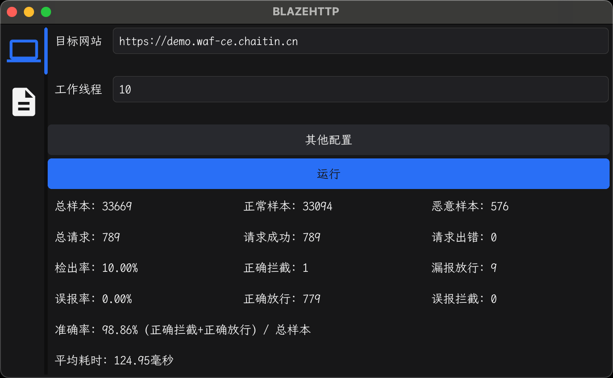

<h1 align="center">最好用的 WAF 测试工具</h1>
<p align="center">
  
  
</p>

## 功能特性

* 样本多，总样本**33669**条，白样本33094条，黑样本**576**条
* 零配置，一个 URL 即可测试 WAF 的各类指标，无需额外配置样本
* 指标简单，通过检出率，误报率，准确率来衡量 WAF 的综合能力

## 测试指标

|  指标   | 描述  | 统计方法  |
|  ----  | ----  | ----  |
| 检出率  | 用来反应 WAF 检测能力的全面性，没有检出即为 ”漏报“。 | 攻击样本拦截数量  |
| 误报率  | 用来反应对正常流量的干扰，不靠谱的结果即为 ”误报“。 | 正常样本拦截数量 |
| 准确率  | 准确率是检出率和误报率的综合指标，避免漏报和误报顾此失彼。 |  |
| 检测耗时  | 用来反应 WAF 性能，耗时越大则性能越差。 |  |

## 安装

### 命令行

提供 windows/linux/MacOS 平台下 amd64 和 arm64 的命令行工具，可[免费下载](https://github.com/chaitin/blazehttp/releases)

下载相应的版本(这里以linux amd64为例)后执行

```bash
# 赋予可执行权限
chmod +x blazehttp_1.0.0_linux_amd64
# 测试对应的网站
./blazehttp_1.0.0_linux_amd64 -t https://demo.waf-ce.chaitin.cn
```

### GUI

提供 windows 和 MacOS 的安装包，可[免费下载](https://github.com/chaitin/blazehttp/releases)

> 如果 MacOS 双击打开报错**不受信任**或者**移到垃圾箱**，执行下面命令后再启动即可：
> ``` bash
> sudo xattr -d com.apple.quarantine blazehttp_1.0.0_darwin_arm64.app
> ```

## 源码构建

### 🚛 下载代码

``` bash
git clone https://github.com/chaitin/blazehttp.git && cd blazehttp
```

### 🚀 一键运行

``` bash
bash build.sh && ./build/blazehttp -t http://127.0.0.1:8008
```

### 🕹️ 靶机服务

``` bash
docker run -d -p 8080:80 --name hello_waf -d co0ontty/hello_waf:latest
```
